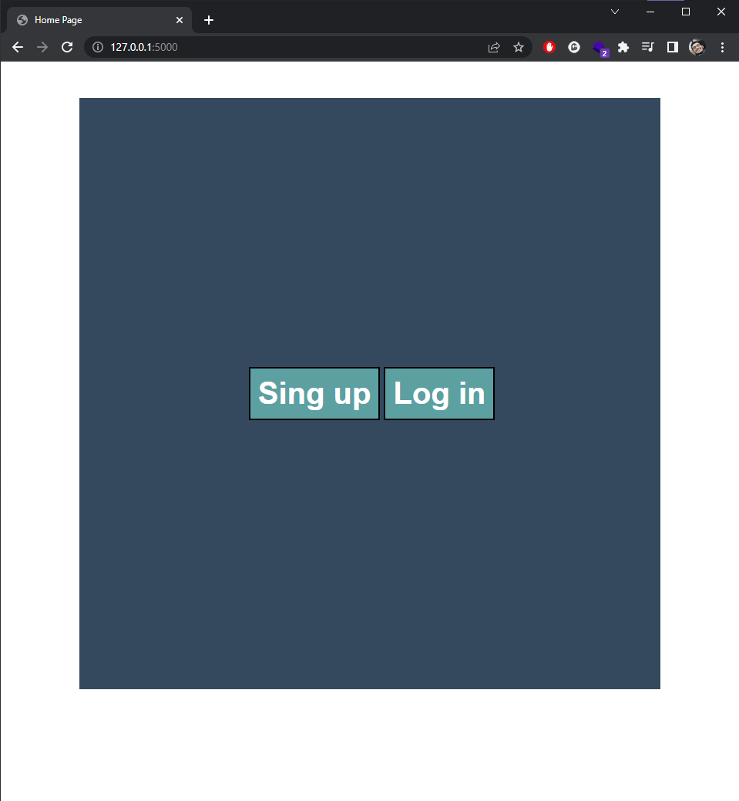
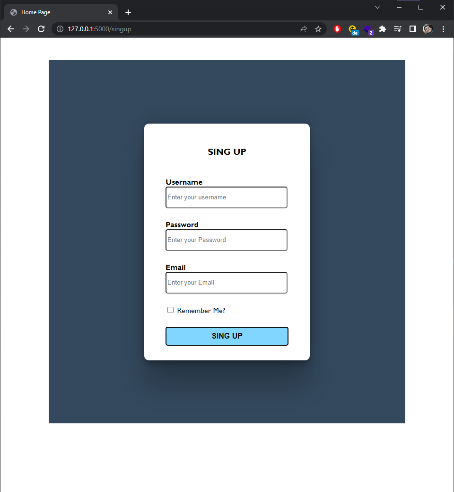
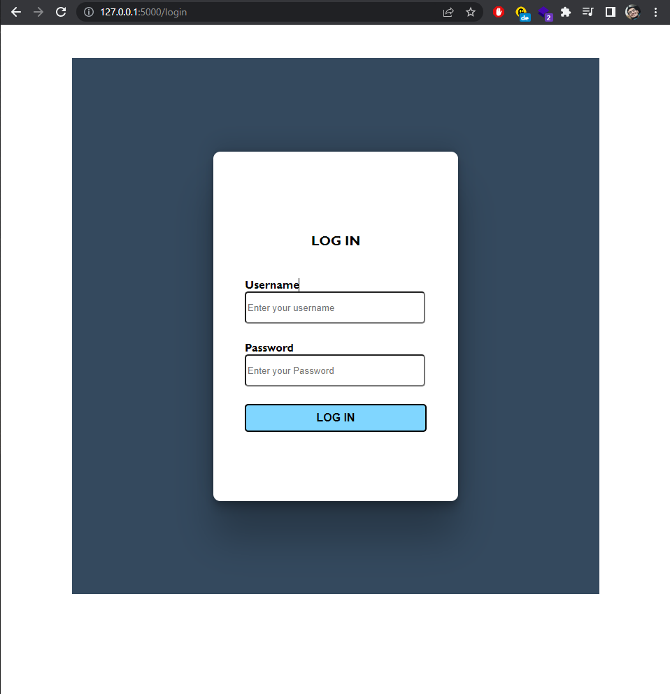
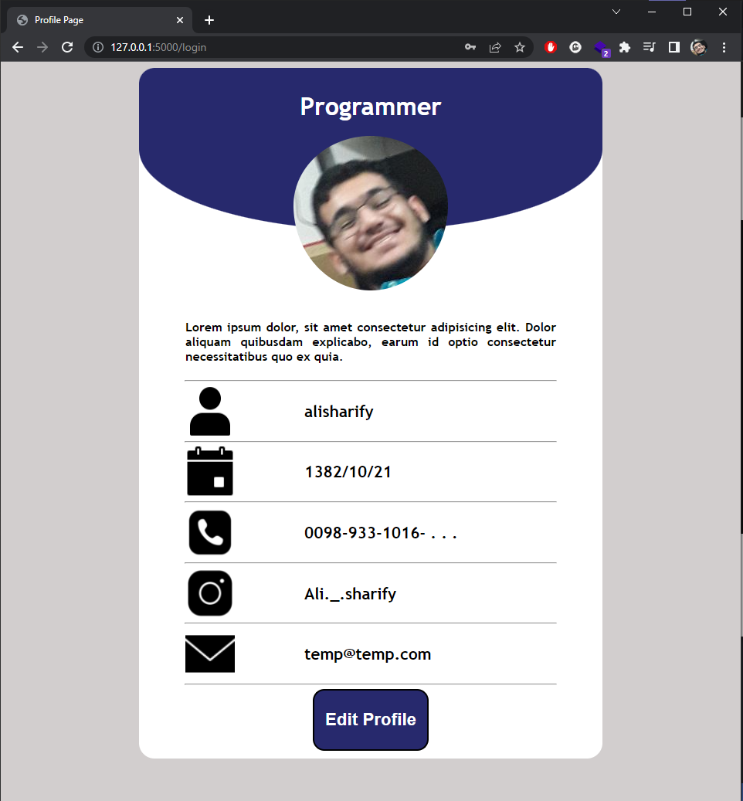
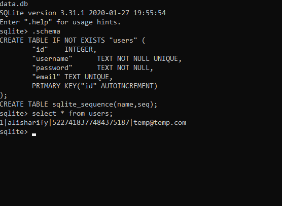
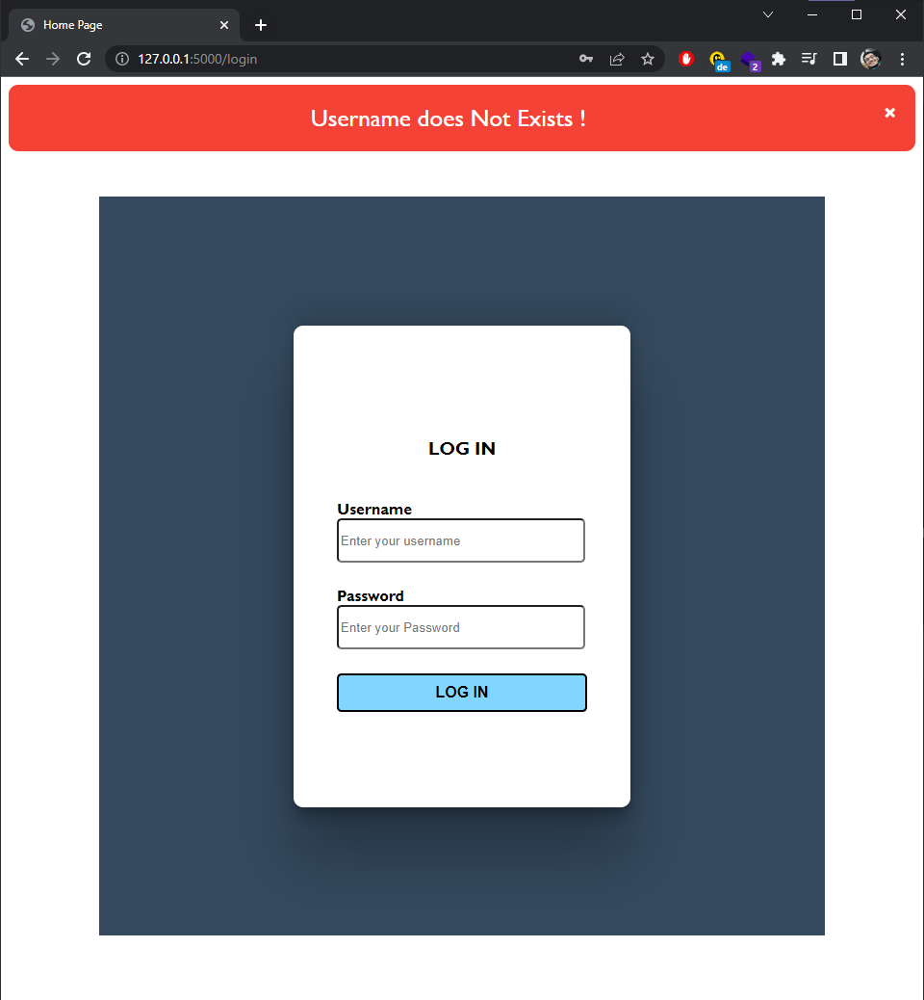

implementation of a Sing in and Login page with Flask

### home page

### Sing in Page

### Log in Page

### after log in 

### data base Stored hashed password

___
### web app also can Handel Error's :

